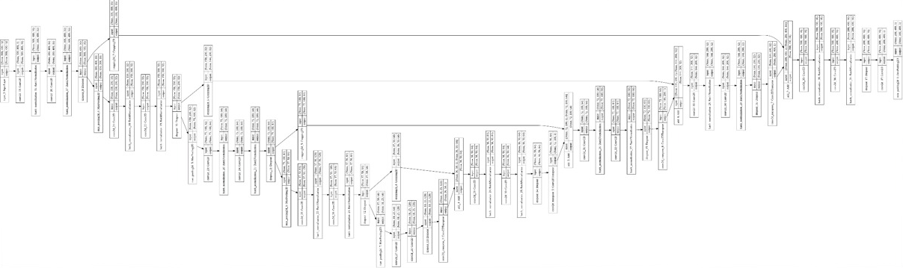
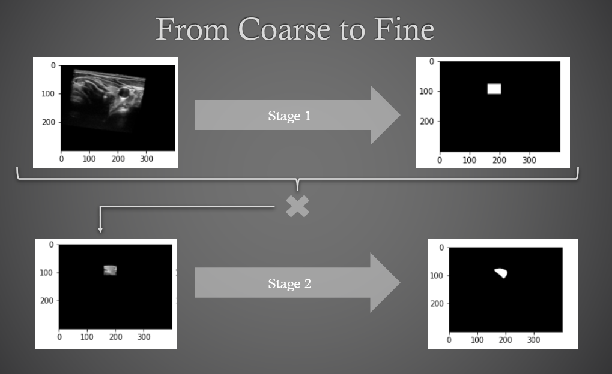
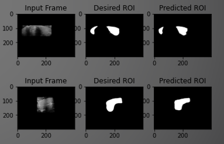

# deep-US-analysis
A CNN for segmentation thyroid segmentation in Ultrasound images

We propose a two stage coarse-to-fine network utilizing two deep Convolutional Neural Networks to provide quality pixel-wise segmentation of the thyroid in 2D slices of a 3D volume.  Using two networks of the same structure optimized for different tasks, we create a joint pipeline working in unison to allow each network to take on an easier “role.”  We train the networks based on custom loss criteria and utilize downsampling and upsampling to simplify the task of each network.

     

The first network "ROINet" is responsible for finding a bounding box around the desired object.  The second network "FineNet" can focus only on this part of the image to locate the object.

     

Final Results:

     

